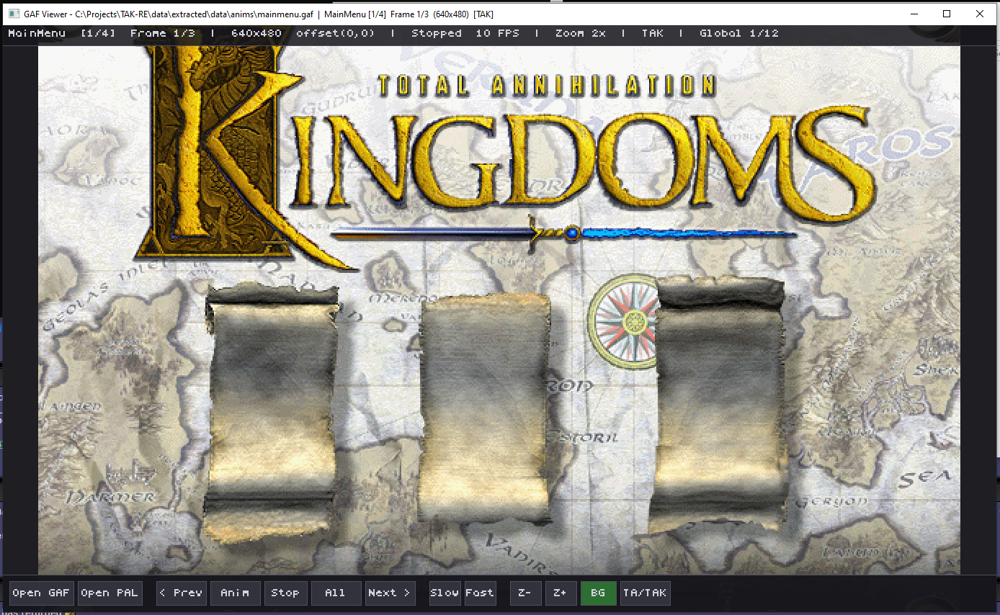

# GAF Viewer

A cross-platform viewer for **Total Annihilation** and **TA: Kingdoms** GAF sprite files.



## Why This Exists

I've been playing TAK since I was 9 years old. The TA/TAK modding community has kept these games alive for over two decades, and it's great to finally give something back. TAK is a big reason why I'm a programmer today!

For years, the community has had Joe D's excellent `ta-gaf-fmt.txt` document describing the GAF file format. Tools like GAF Builder and GAF Viewer were built on that spec, and they work great for **original TA** GAF files. But they've always struggled with **TA: Kingdoms** GAF files. Colors come out wrong, sprites look garbled, or files simply fail to open.

The reason is simple: **TAK uses a completely different RLE compression scheme than TA**, even though the container format (headers, entry tables, frame pointers) is identical. Joe D's spec documents TA's RLE perfectly, but nobody had cracked TAK's variant - until now.

This viewer was built as part of TAK Rebooted project I'm working on. By reading the actual sprite rendering code in the old game, I recovered the exact RLE encoding TAK uses. This viewer implements both schemes, so it should correctly displays GAF files from **both** games. If it doesn't, (I haven't tested it with TA GAF files as I only play TAK) submit a PR or an issue... and I can try to make it happen!

## The Two RLE Schemes

**TA's RLE** (documented by Joe D in `ta-gaf-fmt.txt`):
- Uses byte ranges: `0x01-0x7F` = literal run, `0x81-0xFE` = transparent skip
- Special bytes: `0x00` = end of line, `0x80` = extended literal, `0xFF` = extended skip
- This has been known and working in community tools for 20+ years

**TAK's RLE**:
- Uses the low 2 bits of each control byte as flags:
  - `bit0=1`: transparent skip, count = byte >> 1
  - `bit0=0, bit1=0`: literal pixels, count = (byte >> 2) + 1
  - `bit0=0, bit1=1`: repeat single color, count = (byte >> 2) + 1
- This is why existing viewers couldn't display TAK sprites correctly - they were applying TA's decode logic to TAK's differently-encoded data

The viewer defaults to TAK mode. Press **T** to toggle if a file looks wrong - that usually means it needs the other decode mode.

## Download

Pre-built binaries are available on the [Releases](../../releases) page:

| Platform | Download |
|----------|----------|
| Windows  | `gaf-viewer-windows.zip` - extract and run `gaf-viewer.exe` |
| Linux    | `gaf-viewer-linux.tar.gz` - extract and run `./gaf-viewer` |
| macOS    | `gaf-viewer-macos.tar.gz` - extract and run `./gaf-viewer` |

No installation required. Just download, extract, and run.

Note that I've only fully tested the Windows one!

## Usage

```
gaf-viewer [file.gaf] [palette.pal|palette.pcx]
```

You can also launch it with no arguments.. in that case, it opens a welcome screen where you can click **Open GAF** or drag & drop files.

**Examples:**
```bash
# View a TAK GAF file (palette auto-detected from matching .pcx file)
gaf-viewer singlemachine.gaf

# View with an explicit palette
gaf-viewer singlemachine.gaf singlemachine.pcx

# View a TA GAF file (press T to switch to TA decode mode if needed)
gaf-viewer explode.gaf palette.pal

# Launch the viewer with no file, then use Open GAF button or drag & drop
gaf-viewer
```

You can **drag and drop** `.gaf`, `.pal`, and `.pcx` files onto the viewer window at any time.

## Controls

### Keyboard

| Key | Action |
|-----|--------|
| Left / Right | Step through all frames (crosses entry boundaries) |
| Up / Down | Jump between entries |
| Space | Play/pause entry animation (game-style: cycles frame 0 of each entry) |
| A | Play/pause all-frames animation |
| O | Open GAF file (native file dialog on Windows) |
| P | Open palette file |
| T | Toggle between TA and TAK decode mode |
| F | Toggle checkerboard transparency background |
| + / - | Zoom in / out |
| [ / ] | Slower / faster animation |
| Escape | Quit |

### Toolbar Buttons

| Button | Action |
|--------|--------|
| Open GAF | Open a GAF file via file dialog |
| Open PAL | Open a palette file via file dialog |
| < Prev / Next > | Step backward/forward through frames |
| Anim | Play/pause entry animation (game-style) |
| Stop | Stop animation |
| All | Play/pause all-frames animation |
| Slow / Fast | Decrease/increase animation speed |
| Z- / Z+ | Zoom out / in |
| BG | Toggle checkerboard transparency background |
| TA/TAK | Toggle between TA and TAK decode mode |
| P< / P> | Cycle through available palette files |

## Animation Modes

GAF files contain multiple **entries** (named sprite groups), each with one or more **frames**.

- **Entry Animation (Space / Anim button):** Cycles through frame 0 of each entry in sequence.

- **All Frames (A / All button):** Steps through every frame of every entry sequentially. Useful for inspecting all content in the file.

## Palette Files

GAF sprites use 8-bit palette indices, not direct colors. To see correct colors, the viewer needs a palette file (`.pal` or `.pcx`).

### Auto-Detection (with built-in lookup table)

The viewer includes a **built-in palette lookup table** reverse-engineered from the original TAK Kingdoms game binary. When you open a TAK GAF file, the viewer automatically selects the correct palette based on how the original engine loads it:

1. **Lookup table match** - checks the GAF filename against a table of known palette assignments.
2. A `.pcx` file with the same name next to the GAF (e.g. `singlemachine.pcx` for `singlemachine.gaf`)
3. A `.pal` file with the same name next to the GAF
4. The looked-up palette (e.g. `guipal.pcx`) in the same directory or `../palettes/`
5. Fallback to `guipal.pcx` or `gameart.pcx`

This means **most TAK GAF files should display with correct colors out of the box** as long as the palette files are in the expected directory structure (e.g. extracted game data with `data/anims/` and `data/palettes/` directories).

### Palette Cycling

**If the colors still look wrong**, use the **P<** / **P>** buttons to cycle through all available `.pcx` palette files found near the GAF. The info bar shows which palette is currently loaded and its position in the list. You can also click **Open PAL** to manually load any palette file.

Different GAF files use different palettes - the original game engine hard-codes which palette to load for each rendering context. The built-in lookup table covers the known mappings:

| Palette | Used For |
|---------|----------|
| `singlemachine.pcx`, `bodgirl.pcx`, etc. | Menu character sprites (palette matches the GAF name) |
| `guipal.pcx` | GUI elements: commongui, scrollbars, fonts, HUD buttons, menus |
| `modalbuttons.pcx` | In-game modal dialog buttons |
| `gameart.pcx` | General game artwork (default fallback) |
| `ara_textures.pcx` / `aramon_features.pcx` | Aramon units / map features |
| `tar_textures.pcx` / `taros_features.pcx` | Taros units / map features |
| `ver_textures.pcx` / `veruna_features.pcx` | Veruna units / map features |
| `zon_textures.pcx` / `zhon_features.pcx` | Zhon units / map features |
| `fx.pcx` | Visual effects: smoke, fire, death, shadows, damage |
| `cursors.pcx` | Mouse cursor sprites |
| `colorlogos.pcx` | Faction logos, team logos |

**Note on faction sprites:** Unit sprites (e.g. `verarcher.gaf`) and map feature sprites (e.g. `verhut.gaf`) use the same filename prefix (`ver*`) but different palettes (`ver_textures.pcx` vs `veruna_features.pcx`). The viewer tries both automatically. If neither looks right, use **P>** to cycle.

## Supported Formats

| Format | Extension | Game | Status |
|--------|-----------|------|--------|
| GAF (8-bit paletted, RLE compressed) | `.gaf` | TA and TAK | Supported |
| GAF (8-bit paletted, uncompressed) | `.gaf` | TA and TAK | Supported |
| TAF (16-bit truecolor) | `.taf` | TAK only | Not yet supported |
| PAL (256-color palette) | `.pal` | Both | Supported |
| PCX (palette embedded in image) | `.pcx` | Both | Supported (palette extraction) |

## Building from Source

**Requirements:** CMake 3.16+, a C compiler, SDL2 development libraries.

### Windows (with vcpkg)
```bash
vcpkg install sdl2:x64-windows
cmake -B build -DCMAKE_TOOLCHAIN_FILE=[vcpkg-root]/scripts/buildsystems/vcpkg.cmake
cmake --build build --config Release
```

### Linux
```bash
sudo apt install libsdl2-dev   # Debian/Ubuntu
cmake -B build -DCMAKE_BUILD_TYPE=Release
cmake --build build
```

### macOS
```bash
brew install sdl2
cmake -B build -DCMAKE_BUILD_TYPE=Release
cmake --build build
```

The built executable is at `build/gaf-viewer` (or `build/Release/gaf-viewer.exe` on Windows).

## Contributing

Issues and pull requests are welcome. If you find a GAF file that doesn't display correctly, please open an issue with the file attached.

## License

MIT License. See [LICENSE](LICENSE) for details.

## Credits

- **[Joe D](https://github.com/joe-d-cws)** (`joed@cws.org`) - Original GAF format documentation (`ta-gaf-fmt.txt`), which has been the foundation of TA modding tools for over two decades
- **TAK RLE format** - Reverse-engineered from the TA: Kingdoms game binary as part of my local, TAK Rebooted project.
- Built with love for the Total Annihilation and TA: Kingdoms modding community
